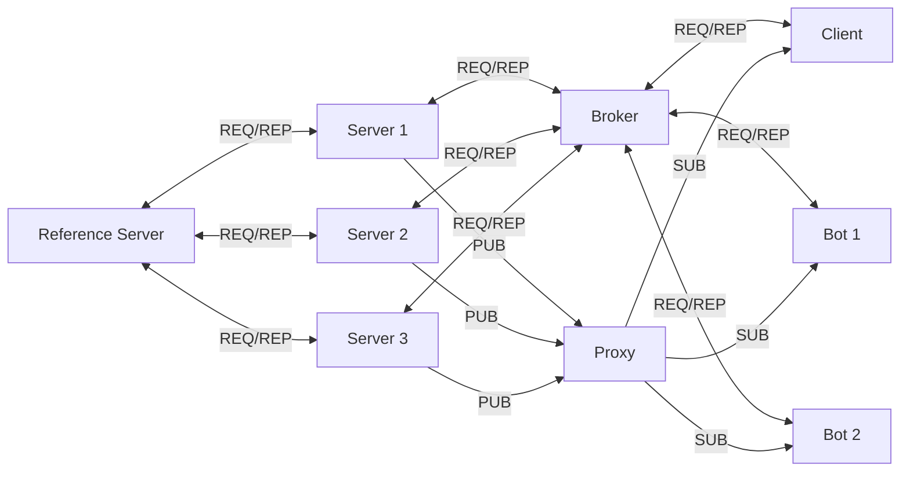
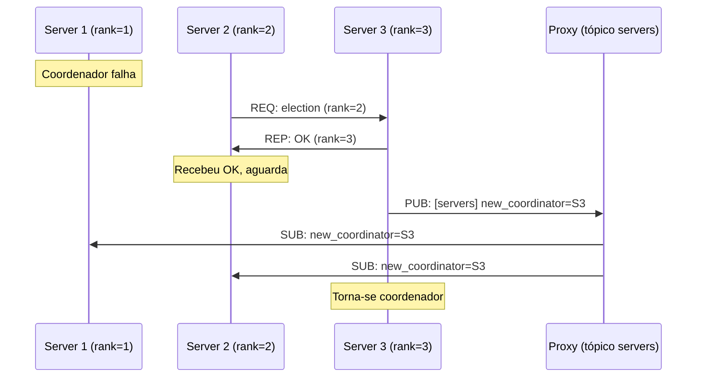
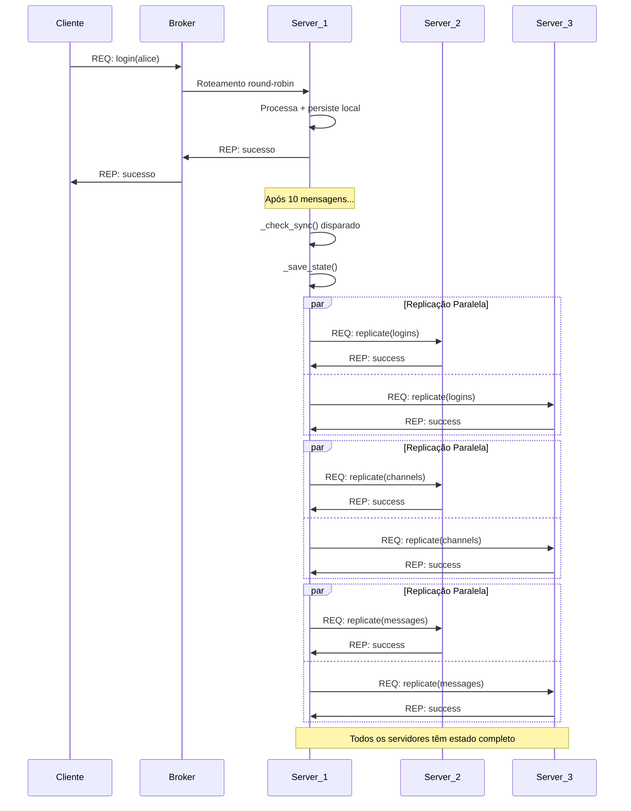
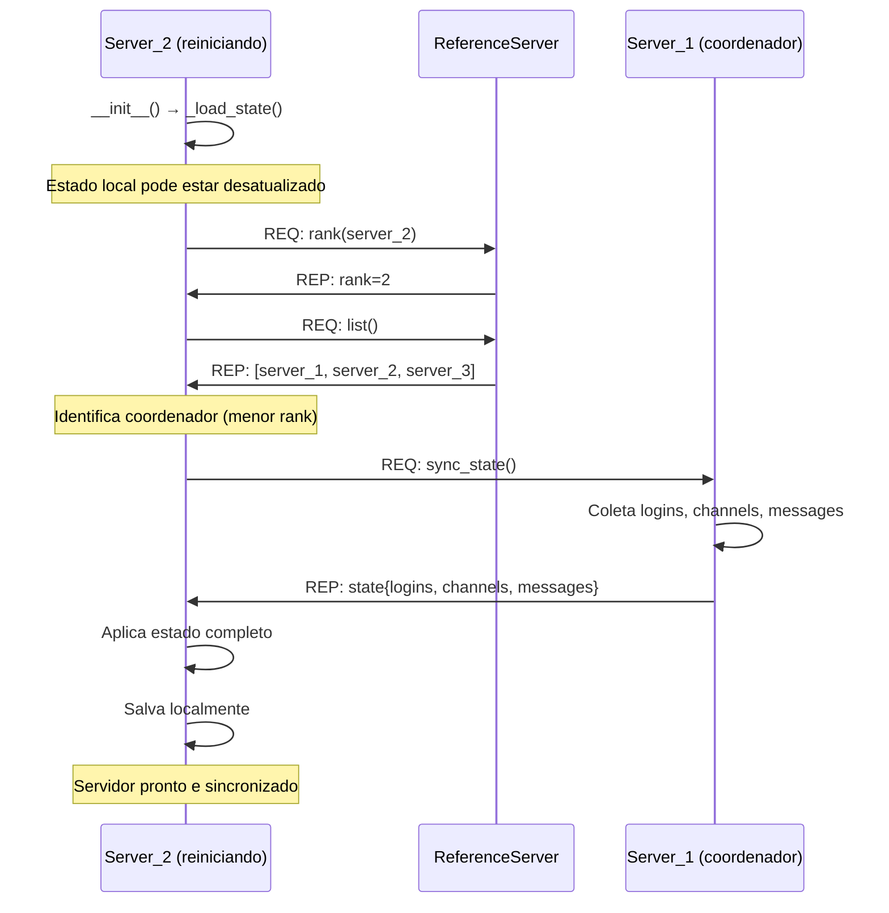

# Sistema BBS - Bulletin Board System Distribuído

## 📋 Índice

- [Sobre o Projeto](#sobre-o-projeto)
- [Arquitetura do Sistema](#arquitetura-do-sistema)
- [Tecnologias Utilizadas](#tecnologias-utilizadas)
- [Componentes do Sistema](#componentes-do-sistema)
- [Persistência Local](#persistência-local)
- [Comunicação e Padrões](#comunicação-e-padrões)
- [Relógios Lógicos e Sincronização](#relógios-lógicos-e-sincronização)
- [Replicação e Consistência](#replicação-e-consistência)
- [Como Executar](#como-executar)
- [Como Testar](#como-testar)
- [Estrutura de Diretórios](#estrutura-de-diretórios)
- [Troubleshooting](#troubleshooting)

---

## 🎯 Sobre o Projeto

O **Sistema BBS (Bulletin Board System)** é uma implementação moderna e distribuída inspirada nos sistemas de troca de mensagens dos anos 1970-1980. O projeto foi desenvolvido como parte da disciplina de **Sistemas Distribuídos** e implementa conceitos fundamentais como:

- ✅ **Comunicação assíncrona** via ZeroMQ (REQ-REP, PUB-SUB, ROUTER-DEALER, XSUB-XPUB)
- ✅ **Serialização binária** com MessagePack em todas as mensagens
- ✅ **Balanceamento de carga** round-robin automático no broker
- ✅ **Relógios lógicos de Lamport** para ordenação causal
- ✅ **Sincronização de relógio físico** com algoritmo de Berkeley
- ✅ **Replicação ativa** entre 3 servidores com consistência eventual
- ✅ **Eleição de coordenador** automática baseada em rank
- ✅ **Persistência local** em arquivos JSON
- ✅ **Histórico de mensagens** com recuperação de canais e mensagens privadas

O sistema permite que **usuários troquem mensagens privadas** e **publiquem em canais públicos**, com todas as interações **replicadas entre servidores** e **persistidas em disco** para recuperação posterior.

---

## 🏗️ Arquitetura do Sistema

### Diagrama de Componentes



### Componentes Principais

| Componente | Linguagem | Função | Porta(s) |
|------------|-----------|--------|----------|
| **Broker** | C | Intermediário REQ-REP (ROUTER-DEALER), faz balanceamento de carga round-robin | 5555 (frontend), 5556 (backend) |
| **Proxy** | JavaScript | Roteador PUB-SUB (XSUB-XPUB), distribui publicações | 5557 (XSUB), 5558 (XPUB) |
| **Reference Server** | Python | Coordenação, atribuição de ranks, heartbeat, eleição | 5559 |
| **Message Server** | Python | Gerencia login, canais, mensagens, sincronização Berkeley, replicação ativa | 3 réplicas (porta 6000 para P2P) |
| **Client** | JavaScript | Interface interativa para o usuário | - |
| **Bot** | Python | Cliente automático que gera mensagens | 2 réplicas |

---

## 🛠️ Tecnologias Utilizadas

### Linguagens de Programação

O projeto foi desenvolvido em **três linguagens diferentes**, conforme requisito:

1. **C** - Broker (comunicação de baixo nível)
2. **JavaScript (Node.js)** - Proxy e Cliente (interface e roteamento)
3. **Python** - Servidores e Bots (lógica de negócio e automação)

### Bibliotecas e Frameworks

- **ZeroMQ** - Biblioteca de mensageria assíncrona
  - Padrões: REQ-REP, PUB-SUB, ROUTER-DEALER, XSUB-XPUB
- **MessagePack** - Serialização binária eficiente
- **Docker & Docker Compose** - Containerização e orquestração

### Dependências Específicas

**Python:**
```
pyzmq>=25.0.0
msgpack>=1.0.0
```

**Node.js:**
```
zeromq: ^5.2.8
msgpack-lite: ^0.1.26
```

**C:**
```
libzmq3-dev
gcc/make
```

---

## 📦 Componentes do Sistema

### 1. Broker (C)

**Responsabilidades:**
- Intermediário entre clientes e servidores
- Implementa padrão ROUTER-DEALER
- Balanceamento de carga round-robin automático
- Roteamento transparente de requisições

**Portas:**
- `5555` - Frontend (clientes conectam aqui)
- `5556` - Backend (servidores conectam aqui)

### 2. Proxy (JavaScript)

**Responsabilidades:**
- Roteador de publicações PUB-SUB
- Implementa padrão XSUB-XPUB
- Conecta publicadores (servidores) com assinantes (clientes/bots)
- Gerencia assinaturas de tópicos

**Portas:**
- `5557` - XSUB (servidores publicam aqui)
- `5558` - XPUB (clientes/bots assinam aqui)

### 3. Reference Server (Python)

**Responsabilidades:**
- **Atribuição de Ranks:** Cada servidor recebe um rank único
- **Lista de Servidores:** Mantém registro de todos os servidores ativos
- **Heartbeat:** Monitora saúde dos servidores (timeout: 30s)
- **Coordenação:** Base para eleição de coordenador

**Serviços:**
- `rank` - Atribui rank a um servidor
- `list` - Retorna lista de servidores ativos
- `heartbeat` - Atualiza status de servidor

### 4. Message Server (Python)

**Responsabilidades:**
- Gerenciamento de usuários (login)
- Gerenciamento de canais (criação, listagem)
- Mensagens privadas entre usuários
- Publicações em canais públicos
- Persistência de dados
- Sincronização Berkeley (coordenador)
- Replicação ativa de estado (servidor-a-servidor)
- Histórico de mensagens

**Serviços:**
- `login` - Cadastra novo usuário
- `users` - Lista usuários cadastrados
- `channel` - Cria novo canal
- `channels` - Lista canais disponíveis
- `get_history` - Retorna histórico de canal
- `get_private_history` - Retorna mensagens privadas
- `publish` - Publica mensagem em canal
- `message` - Envia mensagem privada

**Sincronização:**
- Sincroniza a cada 10 mensagens processadas
- Implementa relógio lógico de Lamport
- Comunica-se com Reference Server via heartbeat

### 5. Client (JavaScript)

**Responsabilidades:**
- Interface interativa para usuário
- Conexão ao broker para requisições
- Assinatura de canais e mensagens privadas
- Exibição de mensagens recebidas

**Comandos Disponíveis:**
```
/help                    - Mostra ajuda
/users                   - Lista usuários
/channels                - Lista canais
/create <canal>          - Cria canal
/join <canal>            - Inscreve-se em canal
/leave <canal>           - Cancela inscrição
/msg <usuário> <texto>   - Mensagem privada
/pub <canal> <texto>     - Publica em canal
/quit                    - Sai do cliente
```

### 6. Bot (Python)

**Responsabilidades:**
- Cliente automático para testes
- Escolhe canal aleatório
- Envia 10 mensagens predefinidas
- Loop contínuo de publicações

**Comportamento:**
1. Faz login com nome `bot_{ID}`
2. Cria canais padrão (geral, tecnologia, random)
3. Escolhe canal aleatório
4. Envia 10 mensagens (delay de 2-5s entre mensagens)
5. Aguarda 5-10s e repete

---

## 💾 Persistência Local

Todos os dados são **persistidos localmente em arquivos JSON**, sem uso de bancos de dados externos.

### Estrutura de Dados

```
/data/
├── logins.json         # Histórico de logins
├── channels.json       # Canais criados
├── messages.json       # Todas as mensagens (públicas e privadas)
├── reference.json      # Estado do servidor de referência
└── replication/        # Dados de replicação entre servidores
    ├── server_1_*.json
    ├── server_2_*.json
    └── server_3_*.json
```

**Observação:** Cada servidor mantém cópia completa dos dados após sincronização. Arquivos em `/data/replication/` são backups temporários usados durante o processo de replicação.

### Formato dos Arquivos

**logins.json:**
```json
[
  {
    "user": "alice",
    "timestamp": 1698765432.123,
    "clock": 15
  }
]
```

**channels.json:**
```json
[
  {
    "channel": "geral",
    "timestamp": 1698765450.456,
    "clock": 23
  }
]
```

**messages.json:**
```json
[
  {
    "type": "publish",
    "user": "alice",
    "channel": "geral",
    "message": "Olá a todos!",
    "timestamp": 1698765500.789,
    "clock": 42
  },
  {
    "type": "message",
    "src": "alice",
    "dst": "bob",
    "message": "Oi Bob!",
    "timestamp": 1698765510.123,
    "clock": 43
  }
]
```

**reference.json:**
```json
{
  "servers": {
    "server_1": {
      "rank": 1,
      "last_heartbeat": 1698765600.0
    },
    "server_2": {
      "rank": 2,
      "last_heartbeat": 1698765605.0
    }
  },
  "next_rank": 3,
  "timestamp": 1698765610.0
}
```

### Características da Persistência

- ✅ **Automática:** Dados salvos após cada operação
- ✅ **Recuperável:** Estado carregado na inicialização
- ✅ **Thread-safe:** Usa locks para operações concorrentes
- ✅ **Sem dependências:** Apenas arquivos JSON padrão
- ✅ **Portável:** Funciona em qualquer sistema de arquivos

---

## 🔄 Comunicação e Padrões

### Padrões ZeroMQ Utilizados

#### 1. REQ-REP (Request-Reply)
- **Uso:** Cliente ↔ Servidor (via Broker)
- **Padrão:** Síncrono, cada REQ tem um REP
- **Exemplo:** Login, listagem de usuários/canais

#### 2. ROUTER-DEALER (Broker)
- **Uso:** Balanceamento de carga
- **ROUTER:** Frontend, identifica clientes
- **DEALER:** Backend, distribui round-robin para servidores

#### 3. PUB-SUB (Publisher-Subscriber)
- **Uso:** Servidor → Clientes/Bots (via Proxy)
- **Padrão:** Assíncrono, baseado em tópicos
- **Tópicos:** Nomes de canais e usuários

#### 4. XSUB-XPUB (Proxy)
- **Uso:** Roteamento de publicações
- **XSUB:** Recebe publicações dos servidores
- **XPUB:** Distribui para assinantes (clientes/bots)

### Serialização com MessagePack

Todas as mensagens são serializadas usando **MessagePack**, um formato binário eficiente:

**Vantagens:**
- ✅ Menor que JSON (até 50% de redução)
- ✅ Mais rápido para serializar/deserializar
- ✅ Suporte nativo para tipos binários
- ✅ Compatível entre linguagens

**Formato Padrão de Mensagem:**

```json
{
  "service": "nome_do_servico",
  "data": {
    "campo1": "valor1",
    "timestamp": 1698765432.123,
    "clock": 42
  }
}
```

### Formatos de Resposta por Serviço

#### Serviços da Parte 1 (Request-Reply)

**Login, Criação de Canal:** Status `"sucesso"` ou `"erro"` com campo `"description"`

```json
{
  "service": "login",
  "data": {
    "status": "sucesso",
    "timestamp": 1698765432.123,
    "clock": 43
  }
}
```

```json
{
  "service": "login",
  "data": {
    "status": "erro",
    "description": "Usuário já cadastrado",
    "timestamp": 1698765432.123,
    "clock": 43
  }
}
```

#### Serviços da Parte 2 (Publisher-Subscriber)

**Publish, Message:** Status `"OK"` ou `"erro"` com campo `"description"`

```json
{
  "service": "publish",
  "data": {
    "status": "OK",
    "timestamp": 1698765432.123,
    "clock": 44
  }
}
```

```json
{
  "service": "publish",
  "data": {
    "status": "erro",
    "description": "Canal não existe",
    "timestamp": 1698765432.123,
    "clock": 44
  }
}
```

> **📌 Nota de Conformidade:**  
> A diferença entre `"sucesso"` (Parte 1) e `"OK"` (Parte 2) segue literalmente as especificações dos arquivos `parte1.md` e `parte2.md`. O campo de erro foi padronizado como `"description"` conforme especificação da Parte 1.

---

## ⏰ Relógios Lógicos e Sincronização

### Relógio Lógico de Lamport

Implementado em **todos os processos** (clientes, servidores, bots) para ordenação causal de eventos.

**Regras:**
1. **Incremento antes de enviar:** `clock = clock + 1`
2. **Atualização ao receber:** `clock = max(clock_local, clock_recebido) + 1`
3. **Incluído em toda mensagem:** Campo `clock` em `data`

**Implementação:**

```python
# Python
class LogicalClock:
    def __init__(self):
        self.counter = 0
    
    def increment(self):
        self.counter += 1
        return self.counter
    
    def update(self, received_time):
        self.counter = max(self.counter, received_time) + 1
        return self.counter
```

### Sincronização de Relógio Físico (Berkeley)

**Objetivo:** Sincronizar relógios físicos dos 3 servidores para garantir ordenação temporal consistente

**Método Escolhido:** Algoritmo de Berkeley (versão adaptada)

#### Características da Implementação

- ✅ **Coordenador automático** baseado em rank (menor rank = coordenador)
- ✅ **Sincronização periódica** a cada 10 mensagens processadas
- ✅ **Tolerância a falhas** com reeleição automática
- ✅ **Ajustes graduais** para evitar saltos temporais bruscos

#### Como Funciona (Classe `BerkeleySynchronizer`)

1. **Coleta de Timestamps (`collect_timestamps`)**
   - Coordenador envia requisição `get_time` para todos os servidores conhecidos
   - Servidores respondem com `time.time()` atual
   - Timeout de 2 segundos por servidor
   - Retorna lista de tuplas `(server_id, timestamp)`

2. **Cálculo de Offsets (`calculate_offsets`)**
   - Calcula tempo médio entre todos os servidores (incluindo coordenador)
   - Para cada servidor: `offset = average_time - server_time`
   - Armazena offsets no dicionário `self.offsets`

3. **Distribuição de Ajustes (`distribute_offsets`)**
   - Coordenador envia mensagem `adjust_time` para cada servidor
   - Payload: `{'offset': <float>}` (positivo = avançar, negativo = atrasar)

4. **Aplicação de Offset (`apply_offset`)**
   - Servidor recebe offset do coordenador
   - Atualiza `self.time_offset` (acumulativo)
   - Método `get_local_time()` retorna `time.time() + self.time_offset`

5. **Ciclo Completo (`run_synchronization`)**
   - Executado apenas pelo coordenador a cada 10 mensagens
   - Sequência: coleta → cálculo → distribuição
   - Logs detalhados para debugging

#### Eleição de Coordenador (Protocolo Bully)

**Método Escolhido:** Algoritmo Bully completo para eleição distribuída

**Características da Implementação:**
- ✅ **Eleição automática** ao detectar falha do coordenador
- ✅ **Comunicação REQ-REP** via porta 6001 dedicada
- ✅ **Publicação no tópico `servers`** após eleição
- ✅ **Tolerância a falhas** com reeleição imediata
- ✅ **Persistência** de logs de eleição em `/data/replication/election_log.json`

**Como Funciona (Classe `ElectionManager`):**

1. **Detecção de Falha**
   - Thread `_monitor_coordinator()` verifica heartbeat do coordenador
   - Timeout configurável (padrão: 15 segundos)
   - Se coordenador não responde, inicia eleição Bully

2. **Processo de Eleição (Algoritmo Bully)**
   ```python
   # 1. Servidor detecta falha e inicia eleição
   election_manager.start_election()
   
   # 2. Envia REQ 'election' para servidores com rank MAIOR
   for server in higher_rank_servers:
       send_election_request(server)  # Porta 6001
   
   # 3. Se receber OK, cancela eleição (outro assumirá)
   if received_ok:
       return  # Aguarda anúncio
   
   # 4. Se não receber OK, declara-se coordenador
   self._become_coordinator()
   ```

3. **Anúncio de Coordenador**
   - **Via PUB-SUB (tópico `servers`):**
     ```json
     {
       "service": "election",
       "data": {
         "event": "new_coordinator",
         "coordinator": "server_1",
         "rank": 1,
         "timestamp": 1698765678.123
       }
     }
     ```
   - **Via REQ-REP (porta 6001):** Envia anúncio direto para cada servidor
   - Todos os servidores atualizam `self.coordinator` e `self.is_coordinator`

4. **Formato das Mensagens**

   **Requisição de Eleição:**
   ```json
   {
     "service": "election",
     "data": {
       "rank": 2,
       "server": "server_2",
       "timestamp": 1698765678.123
     }
   }
   ```

   **Resposta OK:**
   ```json
   {
     "service": "election",
     "data": {
       "status": "OK",
       "rank": 3,
       "server": "server_3",
       "timestamp": 1698765678.456
     }
   }
   ```

5. **Integração com Componentes**
   - **Berkeley:** Coordenador eleito executa sincronização de tempo
   - **Replicação:** Coordenador gerencia sincronização de dados
   - **ReferenceServer:** Mantém lista autoritativa de servidores e ranks

**Diagrama do Processo:**



**Vantagens:**
- ✅ Eleição rápida (< 5 segundos)
- ✅ Servidor com maior rank sempre vence
- ✅ Notificação imediata via PUB-SUB
- ✅ Fallback REQ-REP para garantir entrega

#### Integração com Replicação

A cada 10 mensagens, o coordenador executa:
1. **Sincronização Berkeley** (`_run_berkeley_sync()`)
2. **Replicação de dados** (`_replicate_current_state()`)

Isso garante que:
- Timestamps nas mensagens replicadas sejam consistentes
- Histórico de mensagens tenha ordenação temporal correta
- Logs de diferentes servidores sejam comparáveis

---

## 🔁 Replicação e Consistência (Parte 5 do Projeto)

### Contexto e Problema

Com balanceamento de carga **round-robin** no broker, cada servidor recebe apenas parte das requisições dos clientes. Sem replicação, isso causa:

- ❌ **Perda de dados** se um servidor falhar
- ❌ **Histórico incompleto** em cada servidor (cliente vê apenas parte das mensagens)
- ❌ **Inconsistência entre réplicas** (cada servidor tem estado diferente)
- ❌ **Impossibilidade de recuperar histórico completo** de canais

**Requisito da Parte 5:** Implementar método de replicação para que **todos os servidores tenham todos os dados**, documentando a escolha e estratégia.

---

### 1. Método Escolhido: **Replicação Ativa (Active Replication)**

#### O que é Replicação Ativa?

Na **Replicação Ativa**, todos os servidores:
- ✅ Processam requisições dos clientes (via balanceamento de carga)
- ✅ Mantêm **cópias completas** do estado do sistema
- ✅ Sincronizam periodicamente entre si (peer-to-peer)
- ✅ Não há distinção entre "primário" e "backup"

**Contraste com Replicação Passiva:**
- Na **Replicação Passiva (Primary-Backup)**, apenas o servidor primário processa requisições e propaga mudanças para backups (que ficam inativos até falha do primário).

---

### 2. Justificativa da Escolha

> **📌 Conformidade com Especificação (Parte 5):**  
> Conforme requisitado em `parte5.md` linha 17, esta seção **"descreve o método escolhido dentre os que já existem"** através de análise comparativa entre Replicação Ativa, Replicação Passiva e algoritmos de consenso (Paxos/Raft).

#### Por que Replicação Ativa?

**Análise Comparativa de Métodos de Replicação:**

| Critério | Replicação Ativa<br/>(Escolhido ✅) | Replicação Passiva<br/>(Primary-Backup) | Consenso Distribuído<br/>(Paxos/Raft) |
|----------|------------------|-------------------|------------|
| **Tolerância a falhas** | ✅ Alta (qualquer servidor pode falhar) | ⚠️ Média (falha do primário requer eleição) | ✅ Alta |
| **Disponibilidade** | ✅ Máxima (todos processam) | ⚠️ Limitada (apenas primário processa) | ✅ Alta |
| **Complexidade** | ⚠️ Média (sincronização P2P) | ✅ Baixa (apenas primário→backups) | ❌ Alta (consenso distribuído) |
| **Performance** | ✅ Boa (carga distribuída) | ⚠️ Primário pode ser gargalo | ⚠️ Overhead de consenso |
| **Consistência** | ⚠️ Eventual | ✅ Forte (primário serializa) | ✅ Forte (consenso) |
| **Adequação ao BBS** | ✅✅✅ Ideal | ⚠️ Subutiliza servidores | ❌ Overkill para chat |

**Decisão:** Replicação Ativa é ideal porque:
1. ✅ **Sistema já tem balanceamento de carga** — todos os servidores devem responder
2. ✅ **Consistência eventual é aceitável** — em um chat, pequenos atrasos (< 1s) são toleráveis
3. ✅ **Simplicidade de implementação** — sem necessidade de algoritmos complexos de consenso
4. ✅ **Alta disponibilidade** — sistema continua funcionando mesmo com 2 dos 3 servidores offline

---

### 3. Protocolo de Sincronização

#### Comunicação Servidor-a-Servidor

Cada servidor:
- **Expõe um socket REP na porta 6000** para receber requisições de outros servidores
- **Usa sockets REQ** para enviar dados aos outros servidores
- **Não há intermediários** (comunicação direta peer-to-peer)

**Endereçamento:** `tcp://server_1:6000`, `tcp://server_2:6000`, `tcp://server_3:6000`

**Razão para porta 6000:** Separação lógica da porta de negócio (5556/broker), evitando conflitos e facilitando firewall/logs.

#### Tipos de Mensagens Trocadas

##### 3.1. Mensagem `replicate` — Sincronização de Dados

**Direção:** Servidor_A → Servidor_B (após processar 10 mensagens)

**Formato (serializado com MessagePack):**
```json
{
  "service": "replicate",
  "data": {
    "source_server": "server_1",
    "type": "logins|channels|messages",
    "payload": [
      {"user": "alice", "timestamp": 1698765432.123},
      {"user": "bob", "timestamp": 1698765433.456}
    ],
    "timestamp": 1698765440.789,
    "clock": 142
  }
}
```

**Resposta:**
```json
{
  "service": "replicate",
  "data": {
    "status": "success|error",
    "records_received": 25,
    "timestamp": 1698765441.012,
    "clock": 143
  }
}
```

##### 3.2. Mensagem `sync_state` — Recuperação Completa

**Direção:** Servidor_novo → Servidor_coordenador (ao reiniciar)

**Formato:**
```json
{
  "service": "sync_state",
  "data": {
    "requester": "server_2",
    "timestamp": 1698765450.000,
    "clock": 5
  }
}
```

**Resposta:**
```json
{
  "service": "sync_state",
  "data": {
    "status": "success",
    "state": {
      "logins": [...],    // Estado completo
      "channels": [...],
      "messages": [...]
    },
    "timestamp": 1698765451.234,
    "clock": 200
  }
}
```

##### 3.3. Mensagem `get_time` — Berkeley Sync

Usada pelo coordenador para coletar timestamps na sincronização de relógio físico.

```json
{
  "service": "get_time",
  "data": {
    "requester": "server_1",
    "timestamp": 1698765460.000
  }
}
```

**Resposta:**
```json
{
  "service": "get_time",
  "data": {
    "time": 1698765460.123,
    "server": "server_2"
  }
}
```

---

### 4. Fluxo de Operações

#### 4.1. Sincronização Periódica (Cenário Normal)



**Código correspondente (`server.py`, linha 297):**
```python
def _check_sync(self):
    if self.message_count % SYNC_INTERVAL == 0:  # A cada 10 mensagens
        self._save_state()
        if self.replication_manager:
            Thread(target=self._replicate_current_state, daemon=True).start()
```

**Implementação (`replication_manager.py`, linha 237):**
```python
def replicate_to_all(self, data_type: str, payload: Any):
    for server in self.known_servers:
        self._replicate_to_server(server['name'], data_type, payload)
```

#### 4.2. Recuperação após Falha

**Cenário:** `server_2` reinicia após crash



**Código (`replication_manager.py`, linha 290):**
```python
def sync_from_coordinator(self, coordinator_name: str) -> bool:
    request = msgpack.packb({'service': 'sync_state', 'data': {...}})
    socket.send(request)
    response = msgpack.unpackb(socket.recv(), raw=False)
    
    if response['data']['status'] == 'success':
        state = response['data']['state']
        self.datastore.save('logins.json', state['logins'])
        self.datastore.save('channels.json', state['channels'])
        self.datastore.save('messages.json', state['messages'])
```

#### 4.3. Quem Inicia a Replicação?

**Estratégia Push (implementada):**
- ✅ Servidor que **processa** a requisição **envia** para os outros
- ✅ A cada 10 mensagens, servidor faz `replicate_to_all()`
- ✅ Não espera confirmação antes de responder ao cliente (assíncrono)

**Alternativa Pull (não implementada):**
- Servidores periodicamente **solicitam** dados de outros
- Maior latência, mas menor overhead se poucos dados mudarem

---

### 5. Estratégia de Ordenação e Resolução de Conflitos

#### 5.1. Ordenação Causal com Relógios Lógicos

Cada mensagem inclui:
- `timestamp` (float): Relógio físico do servidor (`time.time()`)
- `clock` (int): Relógio lógico de Lamport

**Regra de ordenação:**
```python
def compare(msg1, msg2):
    if msg1['clock'] != msg2['clock']:
        return msg1['clock'] < msg2['clock']  # Lamport decide
    else:
        return msg1['timestamp'] < msg2['timestamp']  # Empate: timestamp físico
```

#### 5.2. Resolução de Conflitos: Modelo Append-Only

**Estratégia:** Não há conflitos porque:
1. **Mensagens são imutáveis** — Uma vez criada, não é editada nem deletada
2. **Operações são comutativas** — Ordem de replicação não afeta resultado final
   - `add_user('alice')` + `add_user('bob')` = `add_user('bob')` + `add_user('alice')`
3. **Replicação substituição completa** — Dados replicados **sobrescrevem** completamente

**Exemplo:**
```python
# Server_1 tem: {users: ['alice', 'bob']}
# Server_2 tem: {users: ['alice']}

# Server_1 replica para Server_2:
replicate(users=['alice', 'bob', 'charlie'])

# Server_2 após replicação: {users: ['alice', 'bob', 'charlie']}
# Substituição completa, sem merge
```

**Código (`replication_manager.py`, linha 94):**
```python
def _handle_replicate(self, data: Dict) -> Dict:
    payload = data.get('payload', [])
    if data_type == 'logins':
        self.datastore.save('logins.json', payload)  # Substituição completa
```

#### 5.3. Garantia de Entrega

**Mecanismo:**
- ✅ **Timeout de 3 segundos** (`zmq.RCVTIMEO = 3000`)
- ✅ **Log de erros** se replicação falhar
- ⚠️ **Sem retry automático** (eventual consistency tolerante a falhas temporárias)

**Código (`replication_manager.py`, linha 262):**
```python
try:
    socket.send(request)
    response = socket.recv()  # Timeout 3s
    if response['data']['status'] == 'success':
        print(f"Dados replicados para {target_server}")
except Exception as e:
    print(f"Erro ao replicar para {target_server}: {e}")
    # Continua sem bloqueio
```

---

### 6. Limitações Conhecidas

| Limitação | Descrição | Impacto | Mitigação |
|-----------|-----------|---------|-----------|
| **Consistência Eventual** | Janela de até 10 mensagens onde servidores divergem | ⚠️ Médio | Aceitável para chat; usuário pode ver mensagem atrasada (< 1s) |
| **Sem Resolução de Conflitos Concorrentes** | Se dois servidores criam canais com mesmo nome simultaneamente | ⚠️ Baixo | Improvável; mesmo que ocorra, última replicação vence |
| **Perda de Dados se Todos Falharem** | Se todos os 3 servidores caírem antes de persistir | ❌ Alto | Dados já processados estão salvos em disco; apenas últimas < 10 mensagens perdem |
| **Sem Transações Distribuídas** | Replicação pode falhar parcialmente (ex: replica logins mas não channels) | ⚠️ Médio | Próxima sincronização corrige; dados são eventualmente consistentes |
| **Largura de Banda** | Replicação completa a cada 10 mensagens pode sobrecarregar rede | ⚠️ Baixo | Para < 1000 msg/s é aceitável; considerar delta-sync para escala maior |
| **Latência de Sincronização** | Atraso de até 10 mensagens (~ 1-5 segundos) | ⚠️ Baixo | Trade-off consciente: performance vs consistência |

---

### 7. Persistência dos Dados Replicados

**Estrutura de Diretórios:**
```
/data/
├── logins.json              # Estado compartilhado
├── channels.json            # Estado compartilhado
├── messages.json            # Estado compartilhado
├── replication/
│   ├── server_1.json        # Log de replicação do server_1
│   ├── server_2.json        # Log de replicação do server_2
│   ├── server_3.json        # Log de replicação do server_3
│   ├── berkeley_sync_server_1.json  # Histórico de sincronização Berkeley
│   ├── berkeley_sync_server_2.json
│   └── berkeley_sync_server_3.json
```

**Exemplo `replication/server_1.json`:**
```json
{
  "server": "server_1",
  "log": [
    {
      "timestamp": 1698765440.789,
      "source": "server_2",
      "type": "messages",
      "records": 15
    },
    {
      "timestamp": 1698765450.123,
      "source": "server_3",
      "type": "channels",
      "records": 3
    }
  ]
}
```

---

### 8. Resumo: Garantias Fornecidas

| Propriedade | Status | Explicação |
|-------------|--------|------------|
| **Disponibilidade** | ✅ Alta | Sistema funciona com 1 de 3 servidores online |
| **Consistência** | ⚠️ Eventual | Janela de inconsistência de até 10 mensagens (~ 1-5s) |
| **Tolerância a Partições (CAP)** | ⚠️ Limitada | Prioriza A e P; consistência é eventual |
| **Durabilidade** | ✅ Alta | Dados persistidos em disco em cada servidor |
| **Ordenação Causal** | ✅ Garantida | Relógios lógicos de Lamport |
| **Idempotência** | ✅ Garantida | Replicação por substituição completa |

**Classificação CAP:** **AP** (Availability + Partition Tolerance) com consistência eventual

---

## 🚀 Como Executar

### Pré-requisitos

- **Docker** (>= 20.10)
- **Docker Compose** (>= 2.0)
- **Git**

### Passo a Passo

#### 1. Clone o Repositório

```bash
git clone <url-do-repositorio>
cd bbs
```

#### 2. Construa as Imagens Docker

```bash
cd docker
docker compose build
```

Este comando irá:
- Compilar o broker em C
- Instalar dependências Node.js para proxy e cliente
- Instalar dependências Python para servidores e bots
- Criar imagens otimizadas para cada componente

**Tempo estimado:** 3-5 minutos na primeira execução

#### 3. Inicie o Sistema

```bash
docker compose up
```

Ou, para rodar em segundo plano:

```bash
docker compose up -d
```

#### 4. Acompanhe os Logs

```bash
# Todos os containers
docker compose logs -f

# Container específico
docker compose logs -f broker
docker compose logs -f server_1
docker compose logs -f bot_1
```

#### 5. Acesse o Cliente Interativo

```bash
docker attach bbs_client
```

Você verá:
```
=== Cliente BBS ===

Digite seu nome de usuário: _
```

#### 6. Pare o Sistema

```bash
docker compose down
```

Para remover também os volumes (dados persistidos):

```bash
docker compose down -v
```

---

## 🧪 Testes Completos

Esta seção contém 13 testes para validar **todas** as funcionalidades do sistema, incluindo as novas features de replicação, sincronização Berkeley e histórico de mensagens.

### Teste 1: Login e Listagem de Usuários

1. Inicie o sistema: `docker compose up`
2. Acesse o cliente: `docker attach bbs_client`
3. Faça login: `alice`
4. Liste usuários: `/users`

**Resultado esperado:**
```
=== Usuários Cadastrados ===
  - alice
  - bot_1
  - bot_2
============================
```

### Teste 2: Criar e Listar Canais

```
/create meucanal
/channels
```

**Resultado esperado:**
```
[CLIENT] Canal #meucanal criado com sucesso

=== Canais Disponíveis ===
  - #geral
  - #tecnologia
  - #random
  - #meucanal
==========================
```

### Teste 3: Inscrever-se e Receber Mensagens de Canal

```
/join geral
```

Aguarde alguns segundos e observe mensagens dos bots:

```
[#geral] bot_1: Olá a todos! 👋
[#geral] bot_2: Como estão as coisas por aqui?
```

### Teste 4: Publicar Mensagem em Canal

```
/pub geral Olá pessoal!
```

### Teste 5: Mensagem Privada

1. No cliente 1: Login como `alice`
2. Abra outro terminal
3. No terminal 2: `docker exec -it bbs_client node client.js`
4. Login como `bob`
5. No cliente de alice: `/msg bob Oi Bob, tudo bem?`
6. No cliente de bob, você verá:

```
[@alice → você]: Oi Bob, tudo bem?
```

### Teste 6: Verificar Persistência

1. Publique algumas mensagens
2. Pare o sistema: `docker compose down`
3. Inicie novamente: `docker compose up`
4. Acesse o cliente e liste usuários/canais

**Resultado esperado:** Dados anteriores foram recuperados

### Teste 7: Verificar Histórico de Mensagens

```
/history geral 20
```

**Resultado esperado:**
```
==================== Histórico de #geral (últimas 20 mensagens) ====================
[2024-01-15 14:30:21] alice: Olá pessoal!
[2024-01-15 14:30:35] bot_1: Olá a todos! 👋
[2024-01-15 14:30:42] bob: Oi Alice!
[2024-01-15 14:30:58] bot_2: Como estão as coisas?
...
====================================================================================
```

**Comandos disponíveis:**
- `/history <canal>` - Últimas 50 mensagens do canal
- `/history <canal> <limite>` - Últimas N mensagens do canal

### Teste 8: Verificar Replicação Entre Servidores

**Objetivo:** Verificar que todos os servidores eventualmente têm os mesmos dados

1. Envie 15+ mensagens para forçar sincronização (acontece a cada 10 mensagens)
2. Verifique logs de replicação:
```bash
docker compose logs server_1 | grep -i "Replicando estado"
docker compose logs server_2 | grep -i "Dados recebidos de"
docker compose logs server_3 | grep -i "Dados recebidos de"
```

**Resultado esperado:**
```
[SERVER:server_1] Replicando estado para todos os servidores
[SERVER:server_2] Dados recebidos de server_1 para replicação
[SERVER:server_3] Dados recebidos de server_1 para replicação
```

3. Verifique arquivos JSON em cada servidor:
```bash
docker exec bbs_server_1 cat /data/messages.json | jq 'length'
docker exec bbs_server_2 cat /data/messages.json | jq 'length'
docker exec bbs_server_3 cat /data/messages.json | jq 'length'
```

**Resultado esperado:** Mesmo número de mensagens em todos os servidores

4. Verifique que comunicação servidor-a-servidor (porta 6000) está funcionando:
```bash
docker compose logs | grep "6000\|replicate"
```

### Teste 9: Verificar Sincronização Berkeley

**Objetivo:** Confirmar que relógios físicos estão sendo sincronizados

1. Envie 12+ mensagens para acionar sincronização
2. Verifique logs do coordenador (rank=1, normalmente server_1):
```bash
docker compose logs server_1 | grep -i "berkeley\|offset\|Coletando timestamps"
```

**Resultado esperado:**
```
[SERVER:server_1] 10 mensagens processadas, acionando sincronização
[SERVER:server_1] Executando sincronização Berkeley
[SERVER:server_1] Coletando timestamps de 2 servidores
[SERVER:server_1] Calculando offsets. Tempo médio: 1705330145.234
[SERVER:server_1] Offset para server_2: +0.012s
[SERVER:server_1] Offset para server_3: -0.008s
[SERVER:server_1] Distribuindo offsets para 2 servidores
```

3. Verifique logs dos servidores subordinados:
```bash
docker compose logs server_2 | grep -i "ajuste\|offset"
docker compose logs server_3 | grep -i "ajuste\|offset"
```

**Resultado esperado:**
```
[SERVER:server_2] Recebido ajuste de relógio: +0.012s
[SERVER:server_3] Recebido ajuste de relógio: -0.008s
```

### Teste 10: Teste de Falha e Recuperação de Servidor

**Objetivo:** Verificar tolerância a falhas e recuperação automática

1. Pare um servidor (não o coordenador):
```bash
docker stop bbs_server_2
```

2. Continue usando o cliente normalmente - envie 5+ mensagens

**Resultado esperado:** Sistema continua funcionando, broker distribui para servidores restantes (server_1 e server_3)

3. Verifique que coordenador detecta falha:
```bash
docker compose logs server_1 | grep -i "server_2"
```

4. Reinicie o servidor:
```bash
docker start bbs_server_2
```

5. Verifique que servidor recupera dados via replicação:
```bash
docker compose logs server_2 | grep -i "Sincronizando do coordenador"
```

**Resultado esperado:** Servidor se ressincroniza automaticamente e recebe dados perdidos

6. Verifique consistência de dados após recuperação:
```bash
docker exec bbs_server_2 cat /data/messages.json | jq 'length'
```

### Teste 10.1: Eleição de Coordenador (Protocolo Bully)

**Objetivo:** Verificar que o algoritmo Bully funciona corretamente ao detectar falha do coordenador

**Pré-requisito:** Sistema rodando com 3 servidores

1. Identifique qual servidor é o coordenador (normalmente server_1 com rank=1):
```bash
docker compose logs | grep "COORDENADOR"
```

2. Pare o coordenador para simular falha:
```bash
docker stop bbs_server_1
```

3. Aguarde 15-20 segundos e verifique logs dos servidores restantes:
```bash
docker compose logs server_2 | grep -i "eleição\|election\|coordenador"
docker compose logs server_3 | grep -i "eleição\|election\|coordenador"
```

**Resultado esperado:**
```
[SERVER:server_2] Coordenador server_1 não responde. Iniciando eleição.
[ELECTION:server_2] Iniciando eleição (rank 2)
[ELECTION:server_2] Enviando requisição ELECTION para server_3 (rank 3)
[ELECTION:server_2] Recebido OK de server_3. Cancelando eleição.
[SERVER:server_3] Requisição de eleição recebida de server_2 (rank 2)
[ELECTION:server_3] Meu rank (3) é maior. Respondendo OK e iniciando eleição.
[ELECTION:server_3] Nenhum servidor com rank maior. Tornando-me coordenador.
[ELECTION:server_3] Sou o novo COORDENADOR (rank 3)
[ELECTION:server_3] Coordenador anunciado no tópico 'servers'
[SERVER:server_2] Anúncio recebido: server_3 é o novo coordenador (rank 3)
```

4. Verifique publicação no tópico `servers`:
```bash
docker compose logs | grep "servers.*new_coordinator"
```

5. Verifique log de eleição persistido:
```bash
docker exec bbs_server_3 cat /data/replication/election_log.json
```

**Resultado esperado:** JSON com histórico de eventos de eleição

6. Reinicie o coordenador original:
```bash
docker start bbs_server_1
```

7. Verifique que ele NÃO retoma coordenação (server_3 continua como coordenador):
```bash
docker compose logs server_1 | grep -i "coordenador"
```

**Resultado esperado:**
```
[SERVER:server_1] Anúncio recebido: server_3 é o novo coordenador (rank 3)
[SERVER:server_1] Coordenador atualizado: None -> server_3
```

**Observações:**
- Servidor com **maior rank** vence a eleição (Bully usa rank como critério)
- Eleição ocorre em < 20 segundos
- Todos os servidores são notificados via tópico `servers`
- Log de eleição é persistido em `/data/replication/election_log.json`

### Teste 11: Relógio Lógico (Lamport)

**Objetivo:** Verificar ordenação causal de eventos

Observe nos logs o valor do `clock` aumentando:

```bash
docker compose logs -f server_1 | grep "clock"
```

**Resultado esperado:**
```
[SERVER:server_1] clock: 42
[SERVER:server_1] clock: 43
[SERVER:server_1] clock: 45  # Pode pular devido a mensagens de outros processos
```

**Interpretação:**
- Cada mensagem incrementa o relógio lógico
- Valores maiores indicam eventos mais recentes (ordenação causal)
- Saltos indicam sincronização com relógios de outros processos

### Teste 12: Heartbeat do Reference Server

**Objetivo:** Verificar que todos os servidores estão registrando presença

```bash
docker compose logs -f reference | grep "heartbeat"
```

**Resultado esperado:**
```
[REFERENCE] Servidor server_1 enviou heartbeat
[REFERENCE] Servidor server_2 enviou heartbeat
[REFERENCE] Servidor server_3 enviou heartbeat
```

**Frequência esperada:** A cada 5 segundos por servidor

### Teste 13: Verificar Bots Automáticos

```bash
docker compose logs bot_1 | tail -50
```

**Resultado esperado:**
```
[BOT:bot_1] Enviando 10 mensagens para #geral
[BOT:bot_1] Mensagem 1/10 enviada para #geral (total: 1, clock: 15)
[BOT:bot_1] Mensagem 2/10 enviada para #geral (total: 2, clock: 17)
...
[BOT:bot_1] Aguardando antes de escolher novo canal...
```

---

## 📁 Estrutura de Diretórios

```
bbs/
├── c/                          # Código em C
│   ├── broker/                 # Broker ROUTER-DEALER
│   │   ├── broker.c
│   │   └── Makefile
│   ├── common_utils/           # Utilitários comuns
│   │   ├── logical_clock.h
│   │   └── logical_clock.c
│   └── server/                 # (Opcional) Servidor em C
│
├── javascript/                 # Código em JavaScript/Node.js
│   ├── client/                 # Cliente interativo
│   │   ├── client.js
│   │   └── package.json
│   ├── proxy/                  # Proxy XSUB-XPUB
│   │   ├── proxy.js
│   │   └── package.json
│   └── common_utils/           # Utilitários comuns
│       ├── logicalClock.js
│       ├── messaging.js
│       └── index.js
│
├── python/                     # Código em Python
│   ├── bot/                    # Bot automático
│   │   ├── bot.py
│   │   └── requirements.txt
│   ├── server/                 # Servidor de mensagens
│   │   ├── server.py
│   │   └── requirements.txt
│   ├── reference_server/       # Servidor de referência
│   │   ├── reference_server.py
│   │   └── requirements.txt
│   └── common_utils/           # Utilitários comuns
│       ├── __init__.py
│       ├── logical_clock.py
│       ├── persistence.py
│       └── messaging.py
│
├── data/                       # Persistência local
│   ├── logins.json
│   ├── channels.json
│   ├── messages.json
│   ├── reference.json
│   └── replication/
│
├── docker/                     # Configuração Docker
│   ├── Dockerfile.broker
│   ├── Dockerfile.proxy
│   ├── Dockerfile.reference
│   ├── Dockerfile.server
│   ├── Dockerfile.client
│   ├── Dockerfile.bot
│   └── docker-compose.yml
│
└── README.md                   # Este arquivo
```

---

## 🐛 Troubleshooting

### Problema: Containers não iniciam

**Sintoma:**
```
ERROR: Service 'broker' failed to build
```

**Solução:**
1. Verifique se Docker está rodando: `docker ps`
2. Limpe containers antigos: `docker compose down -v`
3. Reconstrua: `docker compose build --no-cache`

### Problema: Cliente não conecta ao broker

**Sintoma:**
```
[CLIENT] Erro ao conectar: ECONNREFUSED
```

**Solução:**
1. Verifique se broker está rodando: `docker compose ps`
2. Verifique logs do broker: `docker compose logs broker`
3. Aguarde alguns segundos (containers podem levar tempo para iniciar)
4. Reinicie o cliente: `docker compose restart client`

### Problema: Mensagens não aparecem no cliente

**Sintoma:**
Cliente não recebe publicações de canais

**Solução:**
1. Verifique se inscreveu no canal: `/join nomecanal`
2. Verifique se proxy está rodando: `docker compose ps proxy`
3. Verifique logs do proxy: `docker compose logs proxy`

### Problema: Servidor não sincroniza

**Sintoma:**
Servidores têm dados diferentes após muitas mensagens

**Solução:**
1. Verifique se os 3 servidores estão rodando: `docker compose ps`
2. Verifique heartbeat no reference server: `docker compose logs reference`
3. Aguarde sincronização (acontece a cada 10 mensagens)
4. Verifique logs de replicação:
   ```bash
   docker compose logs server_1 | grep -i "replic"
   ```
5. Verifique conectividade servidor-a-servidor (porta 6000):
   ```bash
   docker compose exec server_1 nc -zv server_2 6000
   ```
6. Verifique sincronização Berkeley:
   ```bash
   docker compose logs server_1 | grep -i "berkeley"
   ```

### Problema: Coordenador não executa sincronização Berkeley

**Sintoma:**
Logs não mostram "Executando sincronização Berkeley"

**Solução:**
1. Verifique qual servidor é o coordenador (rank=1):
   ```bash
   docker compose logs | grep "Rank atribuído"
   ```
2. Verifique se coordenador está processando mensagens:
   ```bash
   docker compose logs server_1 | grep "mensagens processadas"
   ```
3. Sincronização só ocorre a cada 10 mensagens - envie mais mensagens
4. Verifique se outros servidores estão acessíveis:
   ```bash
   docker compose logs server_1 | grep "Coletando timestamps"
   ```

### Problema: Relógio lógico não incrementa

**Sintoma:**
Valor de `clock` não aumenta nos logs

**Solução:**
1. Isso é esperado se não há mensagens sendo trocadas
2. Envie mensagens via cliente ou espere bots enviarem
3. Verifique implementação do relógio lógico em cada componente

### Problema: Bot não publica mensagens

**Sintoma:**
```
[BOT:bot_1] Falha ao enviar mensagem
```

**Solução:**
1. Verifique se servidores estão rodando
2. Verifique se broker está rodando
3. Reinicie o bot: `docker compose restart bot_1`
4. Verifique logs completos: `docker compose logs bot_1`

### Problema: Dados não persistem

**Sintoma:**
Após reiniciar, dados anteriores são perdidos

**Solução:**
1. Verifique se volumes Docker estão criados: `docker volume ls | grep bbs`
2. Não use `docker compose down -v` (remove volumes)
3. Verifique permissões do diretório `/data/`
4. Verifique logs de persistência: `docker compose logs server_1 | grep "salv"`

### Problema: "Permission denied" ao acessar cliente

**Sintoma:**
```
docker attach bbs_client
Error: permission denied
```

**Solução:**
1. Use `sudo docker attach bbs_client`
2. Ou adicione seu usuário ao grupo docker:
```bash
sudo usermod -aG docker $USER
newgrp docker
```

### Problema: Portas já em uso

**Sintoma:**
```
ERROR: for broker  Cannot start service broker: 
Bind for 0.0.0.0:5555 failed: port is already allocated
```

**Solução:**
1. Verifique processos usando a porta: `sudo lsof -i :5555`
2. Mate o processo: `kill -9 <PID>`
3. Ou mude a porta no `docker-compose.yml`:
```yaml
ports:
  - "5565:5555"  # Mapeia porta externa 5565 para interna 5555
```

---

## 📚 Referências

- **ZeroMQ Guide:** https://zguide.zeromq.org/
- **MessagePack:** https://msgpack.org/
- **Lamport Clocks:** "Time, Clocks, and the Ordering of Events in a Distributed System" - Leslie Lamport, 1978
- **Berkeley Algorithm:** "Time Synchronization in Distributed Systems" - Tanenbaum & Van Steen
- **Docker Compose:** https://docs.docker.com/compose/

---

## 👥 Autor

Desenvolvido como projeto da disciplina de **Sistemas Distribuídos**.

**Licença:** MIT

---

## 📝 Notas Finais

Este projeto implementa conceitos fundamentais de sistemas distribuídos de forma prática e funcional. Embora seja uma implementação educacional, demonstra:

✅ Comunicação assíncrona eficiente
✅ Balanceamento de carga automático
✅ Sincronização de relógios distribuídos
✅ Replicação de dados com consistência
✅ Persistência local robusta
✅ Integração multi-linguagem
✅ Containerização e orquestração

**Possíveis Melhorias Futuras:**
- Implementação completa do algoritmo de Berkeley
- Eleição de coordenador mais robusta (Bully Algorithm)
- Criptografia de mensagens
- Autenticação de usuários
- Interface web para o cliente
- Métricas e monitoramento (Prometheus/Grafana)
- Testes automatizados (unit + integration)
- CI/CD pipeline

---

**🎉 Obrigado por usar o Sistema BBS!**

Para dúvidas ou contribuições, abra uma issue no repositório.
